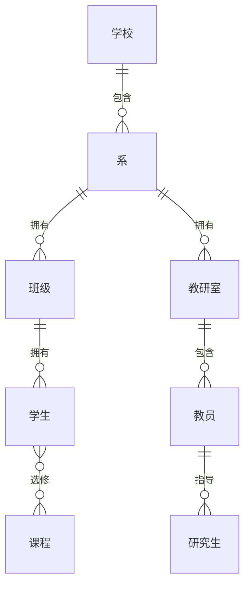

+++
title = "学校概念模型 E-R 图"
author = "Lalalala-yeye"
date = 2026-03-08T00:00:00+08:00
categories = ["SE实验"]
tags = ["SE", "ER图", "数据库", "学习分享"]
draft = false
+++

根据题意：学校有若干系，每系有若干班级和教研室，每教研室有若干教员，教授/副教授各带若干研究生，每班有若干学生，学生与课程为多对多选修关系。
<!--more-->

## E-R 图（Mermaid）

> 说明：**学生—课程** 为多对多联系“选修”，在逻辑设计时可将“选课”设为联系实体并添加属性（如成绩、选课时间）。

## 实体与联系小结

| 实体       | 说明                     |
|------------|--------------------------|
| 学校       | 顶层单位                 |
| 系         | 属于学校，下辖班级、教研室 |
| 班级       | 属于某系，包含学生       |
| 教研室     | 属于某系，包含教员       |
| 教员       | 属于某教研室，部分指导研究生 |
| 研究生     | 被教授/副教授指导        |
| 学生       | 属于某班，选修多门课     |
| 课程       | 被多名学生选修           |

| 联系       | 类型   | 说明               |
|------------|--------|--------------------|
| 包含(系)   | 1∶n    | 学校—系            |
| 拥有(班级) | 1∶n    | 系—班级            |
| 拥有(教研室)| 1∶n   | 系—教研室          |
| 包含(教员) | 1∶n    | 教研室—教员        |
| 指导       | 1∶n    | 教员—研究生        |
| 拥有(学生) | 1∶n    | 班级—学生          |
| 选修       | m∶n    | 学生—课程（可带成绩等属性） |

若站点或主题支持 Mermaid，上述代码会渲染成 E-R 图；否则可把该代码复制到 [Mermaid Live Editor](https://mermaid.live) 中查看。
